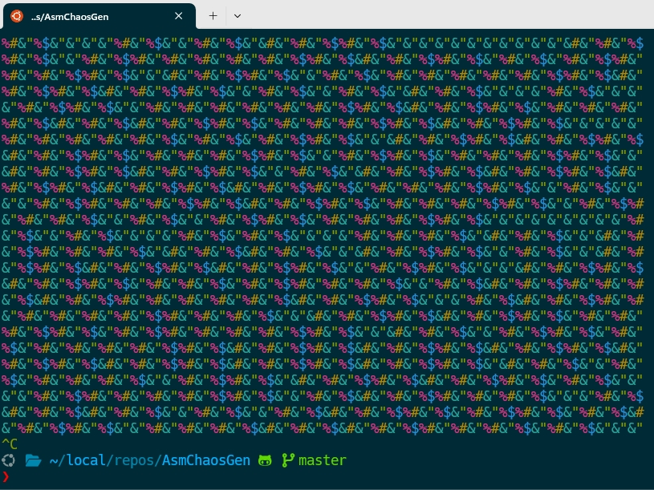

# Chaos Visualiser

Chaos Visualiser is an interactive program that generates an ASCII animation of the logistic map's chaotic behavior. This project combines assembly language for core computations with C++ for visualization, demonstrating how low-level programming can be used to create engaging visual outputs.

## Sample



## Features

- Real-time ASCII animation of the logistic map
- Utilises assembly language for efficient computation
- Colorful terminal output using the rang library
- Demonstrates the chaotic behavior of simple mathematical systems

## Requirements

- NASM (Netwide Assembler)
- GCC (GNU Compiler Collection)
- C++11 compatible compiler
- Linux-based operating system (x86\_64)

## Installation

1. Clone this repository:
   ```
   git clone https://github.com/cschladetsch/chaos-visualiser.git
   cd chaos-visualiser
   ```

2. Ensure you have NASM and GCC installed. On most Linux distributions, you can install them with:
   ```
   sudo apt-get install nasm gcc
   ```

## Usage

To compile and run the Chaos Visualiser, simply execute the provided script:

```
./r
```

This script will:
1. Download the required rang library
2. Assemble the assembly code
3. Compile the C++ wrapper
4. Link the object files
5. Run the resulting executable

## How It Works

The Chaos Visualiser implements the logistic map, a simple mathematical model that can produce complex, chaotic behavior. The logistic map is defined by the equation:

```
x[n+1] = r * x[n] * (1 - x[n])
```

where x is between 0 and 1, and r is a parameter between 0 and 4.

The assembly code calculates the next state of the system, while the C++ code handles the visualization, creating an ASCII art representation of the chaotic system's state.

## Contributing

Contributions to improve the Chaos Visualiser are welcome. Please feel free to submit pull requests or open issues for any bugs or feature requests.

## License

This project is open source and available under the MIT License.
